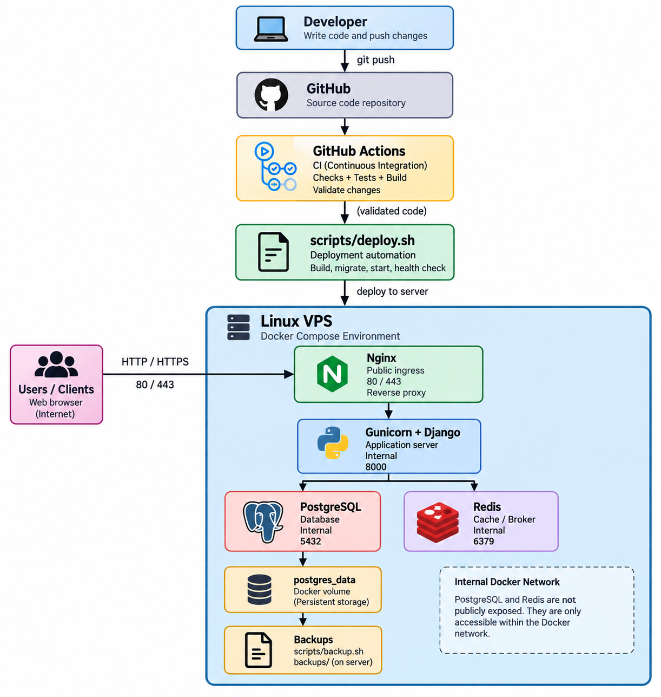

# Production Deployment Demo

## Overview

This repository demonstrates a production-style deployment workflow for a Django web application using Docker Compose, Nginx, Gunicorn, PostgreSQL, Redis, and GitHub Actions.

The goal is to show how a small web application can move from source code into a repeatable, maintainable deployment environment with:

- containerized services
- Nginx reverse proxying
- Gunicorn application serving
- PostgreSQL persistence
- Redis integration
- environment-based configuration
- automated CI validation
- deployment automation
- health checks
- PostgreSQL backups
- restore verification
- rollback procedures
- lightweight monitoring
- basic security hardening
- operational documentation

The application itself is intentionally simple so the focus remains on deployment and operations rather than application features.

---

## Architecture



### High-Level Flow

```text
Developer
    │
    │ git push
    ▼
GitHub
    │
    ▼
GitHub Actions
    │
    │ CI validation
    ▼
Validated Code
    │
    │ scripts/deploy.sh
    ▼
Linux VPS / Docker Compose
    │
    ▼
Nginx
    │
    ▼
Gunicorn + Django
    │
    ├────────► PostgreSQL
    │
    └────────► Redis
```

Public application traffic enters through Nginx.

Django/Gunicorn, PostgreSQL, and Redis communicate through the internal Docker network.

PostgreSQL and Redis are not intended to be publicly exposed.

For a detailed description, see:

[`docs/architecture.md`](docs/architecture.md)

---

## What This Demonstrates

This project demonstrates practical deployment and operations concepts including:

- production-style Django deployment
- Docker image creation
- multi-service Docker Compose orchestration
- Nginx reverse proxy configuration
- Gunicorn WSGI serving
- PostgreSQL database integration
- Redis integration
- persistent database storage
- environment-variable configuration
- application health endpoints
- GitHub Actions Continuous Integration
- automated deployment scripting
- dependency readiness checks
- PostgreSQL backup automation
- restore verification
- application rollback procedures
- lightweight operational monitoring
- basic production security practices
- operational runbooks and documentation

This is a deployment demonstration rather than a feature-heavy application.

---

## Technology Stack

### Application

- Python
- Django
- Gunicorn

### Infrastructure

- Linux
- Docker
- Docker Compose
- Nginx

### Data

- PostgreSQL
- Redis

### Continuous Integration

- GitHub Actions

### Operations

- Bash
- Docker health and service checks
- PostgreSQL `pg_dump`
- automated backup scripts
- deployment automation
- rollback procedures
- monitoring runbooks

---

## Repository Structure

```text
production-deployment-demo/
│
├── application/
│   ├── config/
│   ├── core/
│   ├── Dockerfile
│   ├── manage.py
│   └── requirements.txt
│
├── nginx/
│   └── default.conf
│
├── scripts/
│   ├── deploy.sh
│   ├── backup.sh
│   └── healthcheck.sh
│
├── docs/
│   ├── architecture.md
│   ├── architecture.png
│   ├── backups.md
│   ├── rollback.md
│   ├── monitoring.md
│   └── security.md
│
├── .github/
│   └── workflows/
│       └── ci.yml
│
├── docker-compose.yml
├── .env.example
├── .gitignore
└── README.md
```

---

## Quick Start

### Requirements

Install:

- Git
- Docker
- Docker Compose

Clone the repository:

```bash
git clone git@github.com:makersahil/production-deployment-demo.git
cd production-deployment-demo
```

Create the local environment file:

```bash
cp .env.example .env
```

Review and update the configuration:

```bash
nano .env
```

Build and start the complete stack:

```bash
docker compose up -d --build
```

Check service status:

```bash
docker compose ps
```

The following services should be running:

```text
app
db
redis
nginx
```

Test the application:

```bash
curl http://localhost/
```

Expected response:

```json
{
  "service": "production-deployment-demo",
  "status": "running"
}
```

Test the health endpoint:

```bash
curl http://localhost/health/
```

Expected response:

```json
{
  "status": "healthy"
}
```

---

## Environment Configuration

Application configuration is supplied through environment variables rather than being hardcoded into the source code.

Example:

```env
DJANGO_SECRET_KEY=change-me
DJANGO_DEBUG=False
DJANGO_ALLOWED_HOSTS=localhost,127.0.0.1

POSTGRES_DB=appdb
POSTGRES_USER=appuser
POSTGRES_PASSWORD=change-me
POSTGRES_HOST=db
POSTGRES_PORT=5432

REDIS_URL=redis://redis:6379/0
```

The repository contains:

```text
.env.example
```

to document the required variables using safe placeholder values.

The real:

```text
.env
```

file is excluded from Git.

Verify:

```bash
git check-ignore .env
```

Expected:

```text
.env
```

Real credentials, API keys, private keys, and production secrets should never be committed to the repository.

---

## Application Services

### Nginx

Nginx acts as the public application entry point.

It:

- accepts HTTP traffic
- reverse proxies requests to Gunicorn
- forwards client and proxy headers
- provides the location for TLS termination in a real production deployment

Application traffic flows through:

```text
Client
  ↓
Nginx
  ↓
Gunicorn
  ↓
Django
```

---

### Django + Gunicorn

Django provides the web application.

Gunicorn runs Django as the production WSGI server.

The application listens internally on:

```text
8000/tcp
```

and is not intended to be directly exposed to the internet.

---

### PostgreSQL

PostgreSQL provides persistent relational data storage.

The database:

- uses a dedicated application database
- uses dedicated application credentials
- stores persistent data in a Docker volume
- communicates with Django through the internal Docker network
- is not published as a public host port

Check availability:

```bash
docker compose exec db pg_isready
```

Expected:

```text
accepting connections
```

---

### Redis

Redis provides cache/connectivity functionality for the Django application.

Redis communicates with the application through the internal Docker network.

Check availability:

```bash
docker compose exec redis redis-cli ping
```

Expected:

```text
PONG
```

---

## Deployment

Deployment automation is handled through:

```text
scripts/deploy.sh
```

Run:

```bash
./scripts/deploy.sh
```

The deployment workflow performs:

```text
validate environment
        ↓
obtain latest code
        ↓
validate Docker Compose
        ↓
build application image
        ↓
start PostgreSQL + Redis
        ↓
wait for dependencies
        ↓
run Django migrations
        ↓
start application
        ↓
start Nginx
        ↓
run health check
```

The deployment script starts with:

```bash
set -euo pipefail
```

so critical failures stop execution instead of allowing the script to report a false successful deployment.

The deployment process is designed to be idempotent-ish: running it repeatedly should reconcile the environment rather than deliberately destroying persistent data.

Persistent PostgreSQL volumes are preserved during normal deployment.

---

## Health Checks

The project includes:

```text
scripts/healthcheck.sh
```

Run:

```bash
./scripts/healthcheck.sh
```

The script checks:

```text
http://localhost/health/
```

and fails if the expected healthy response is not returned.

This health check is used during deployment validation and can also be used for lightweight uptime checks.

A running process alone is not considered sufficient proof that the service is operational.

---

## CI/CD

Continuous Integration is implemented using GitHub Actions.

Workflow:

```text
.github/workflows/ci.yml
```

The pipeline performs:

```text
checkout repository
        ↓
setup Python
        ↓
install dependencies
        ↓
Django system checks
        ↓
database migration validation
        ↓
automated tests
        ↓
Docker Compose validation
        ↓
Docker image build
```

The CI workflow was validated using the sequence:

```text
working change
    ↓
PASS

intentional test failure
    ↓
FAIL

test fixed
    ↓
PASS
```

This demonstrates that CI actively validates changes rather than simply containing a workflow configuration file.

### Current CD Status

Automatic production deployment directly from GitHub Actions is not implemented in this demo.

GitHub Actions currently provides CI validation.

Deployment automation is handled separately through:

```text
scripts/deploy.sh
```

This keeps Continuous Integration and deployment automation independently testable.

---

## Backup & Restore

PostgreSQL backups are created using:

```bash
./scripts/backup.sh
```

The backup workflow performs:

```text
check PostgreSQL
        ↓
pg_dump
        ↓
gzip compression
        ↓
store backup
        ↓
apply retention
        ↓
restore verification
```

Backup files are stored under:

```text
backups/
```

Example:

```text
backups/postgres-2026-09-18-010000.sql.gz
```

The `backups/` directory is excluded from Git.

A backup is not considered reliable merely because the file exists.

Restore verification includes:

1. creating a PostgreSQL backup
2. creating a temporary verification database
3. restoring the dump
4. querying expected data
5. confirming that restoration succeeded
6. removing the verification database

For real production systems, backup copies should also be stored on durable off-server storage.

Detailed procedure:

[`docs/backups.md`](docs/backups.md)

---

## Rollback

Rollback procedures are documented in:

[`docs/rollback.md`](docs/rollback.md)

Rollback validation covers:

- identifying the failing release
- identifying a previous known-good release
- preserving logs
- checking whether database migrations changed
- rebuilding the previous application version
- restarting application services
- checking the health endpoint
- verifying PostgreSQL
- verifying Redis
- reviewing application and Nginx logs

Application rollback and database rollback are intentionally treated separately.

A code rollback does not automatically imply that database migrations should be reversed.

Database changes may be destructive, irreversible, or incompatible with older application versions and therefore require separate evaluation.

---

## Monitoring

Monitoring is intentionally lightweight and appropriate for a small deployment.

The monitoring strategy is designed to answer:

```text
Is it reachable?
Is it healthy?
Is it degrading?
If it failed, can I diagnose why?
```

Key checks include:

- HTTP uptime
- HTTP status codes
- application health endpoint
- Docker container status
- CPU utilization
- memory utilization
- disk usage
- PostgreSQL availability
- Redis availability
- backup status
- SSL certificate expiry
- application logs
- Nginx logs
- database logs

Useful commands include:

```bash
./scripts/healthcheck.sh
docker compose ps
docker stats --no-stream
df -h
docker system df
docker compose exec db pg_isready
docker compose exec redis redis-cli ping
docker compose logs --tail=100 app
docker compose logs --tail=100 nginx
```

Monitoring behavior was also tested by deliberately stopping the application container and confirming that:

- the health check failed
- HTTP requests failed
- container status reflected the problem
- Nginx logs provided diagnostic information

Detailed monitoring guide:

[`docs/monitoring.md`](docs/monitoring.md)

---

## Security

The project documents basic production hardening suitable for small application deployments.

Security practices include:

- SSH key authentication
- non-root administrative users
- least privilege
- host firewall rules
- only required public ports
- HTTPS in production
- secrets outside source control
- PostgreSQL kept internal
- Redis kept internal
- security updates
- credential rotation
- protected backups

### Network Exposure

Typical production exposure:

```text
22/tcp   SSH
80/tcp   HTTP
443/tcp  HTTPS
```

PostgreSQL and Redis should remain internal.

The Docker Compose architecture does not intentionally publish PostgreSQL or Redis as public host ports.

### Secrets

The real:

```text
.env
```

file is excluded from Git.

Verify:

```bash
git check-ignore .env
```

The project demonstrates **basic hardening only**.

It does not claim to provide:

- penetration testing
- formal vulnerability assessment
- compliance certification
- advanced threat detection
- a full security audit

Detailed security guidance:

[`docs/security.md`](docs/security.md)

---

## Persistent Data

PostgreSQL data is stored using the Docker volume:

```text
postgres_data
```

This allows PostgreSQL data to survive normal application container recreation.

Commands such as:

```bash
docker compose down -v
```

should not be used casually in production because `-v` removes Docker volumes and can destroy persistent database data.

Application containers should be considered replaceable.

Persistent application data should not.

---

## Failure Scenarios

### Application Failure

Useful checks:

```bash
docker compose ps
docker compose logs app
docker compose logs nginx
```

Typical symptoms include:

- failed health endpoint
- HTTP 502 responses from Nginx
- stopped application container
- repeated application exceptions

---

### PostgreSQL Failure

Check:

```bash
docker compose exec db pg_isready
docker compose logs db
```

Database recovery should consider persistent volume state and available backups.

---

### Redis Failure

Check:

```bash
docker compose exec redis redis-cli ping
docker compose logs redis
```

Expected healthy response:

```text
PONG
```

---

### Nginx Failure

Validate configuration:

```bash
docker compose exec nginx nginx -t
```

Inspect logs:

```bash
docker compose logs nginx
```

---

### Broken Application Release

If a newly deployed release causes failures, use the rollback procedure documented in:

[`docs/rollback.md`](docs/rollback.md)

---

## Production Considerations

This repository demonstrates production-style practices, but a real production deployment should additionally consider:

- a real Linux VPS or cloud environment
- domain configuration
- DNS configuration
- HTTPS certificates
- automatic TLS renewal
- off-server backup storage
- backup encryption where appropriate
- centralized logging
- external uptime monitoring
- automated alerting
- CPU and memory thresholds
- disk-space alerting
- stronger secrets management
- controlled administrative access
- dependency updates
- container image updates
- disaster recovery testing
- scheduled restore verification
- deployment audit trails

For larger deployments, additional technologies may become appropriate, such as:

- infrastructure as code
- managed databases
- centralized metrics
- centralized logs
- secret management systems
- container registries
- container orchestration

Infrastructure complexity should remain proportional to application requirements.

---

## Documentation

Detailed operational documentation is available under:

```text
docs/
```

### Architecture

[`docs/architecture.md`](docs/architecture.md)

Describes:

- system components
- request flow
- deployment flow
- network boundaries
- persistent data
- failure scenarios
- security considerations

---

### Backup & Restore

[`docs/backups.md`](docs/backups.md)

Describes:

- backup creation
- storage
- retention
- restoration
- restore verification

---

### Rollback

[`docs/rollback.md`](docs/rollback.md)

Describes:

- rollback triggers
- pre-checks
- application rollback
- database considerations
- verification procedures

---

### Monitoring

[`docs/monitoring.md`](docs/monitoring.md)

Describes:

- HTTP checks
- resource monitoring
- PostgreSQL monitoring
- Redis monitoring
- backup monitoring
- SSL expiry
- application and infrastructure logs

---

### Security

[`docs/security.md`](docs/security.md)

Describes:

- SSH authentication
- least privilege
- network exposure
- firewall considerations
- secret management
- credential rotation
- backup protection

---

## Project Status

Current implementation:

```text
[✓] Django application
[✓] Gunicorn
[✓] Docker image
[✓] Docker Compose
[✓] Nginx reverse proxy
[✓] PostgreSQL
[✓] Redis
[✓] persistent PostgreSQL volume
[✓] environment-based configuration
[✓] application health endpoint
[✓] GitHub Actions CI
[✓] CI failure validation
[✓] deployment automation
[✓] deployment health checking
[✓] PostgreSQL backup automation
[✓] backup retention
[✓] restore procedure
[✓] restore verification
[✓] rollback procedure
[✓] monitoring documentation
[✓] security documentation
[✓] architecture documentation
[✓] architecture diagram
```

---

## Purpose

This project is intended to demonstrate a practical small-team deployment and operations workflow.

The emphasis is not on building the most complex infrastructure possible.

The emphasis is on building infrastructure that is:

```text
repeatable
observable
recoverable
documented
secure by default
and understandable
```
